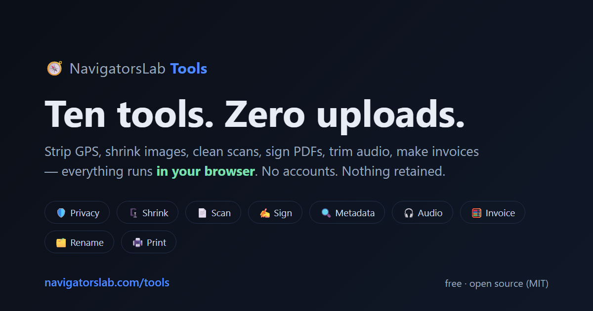
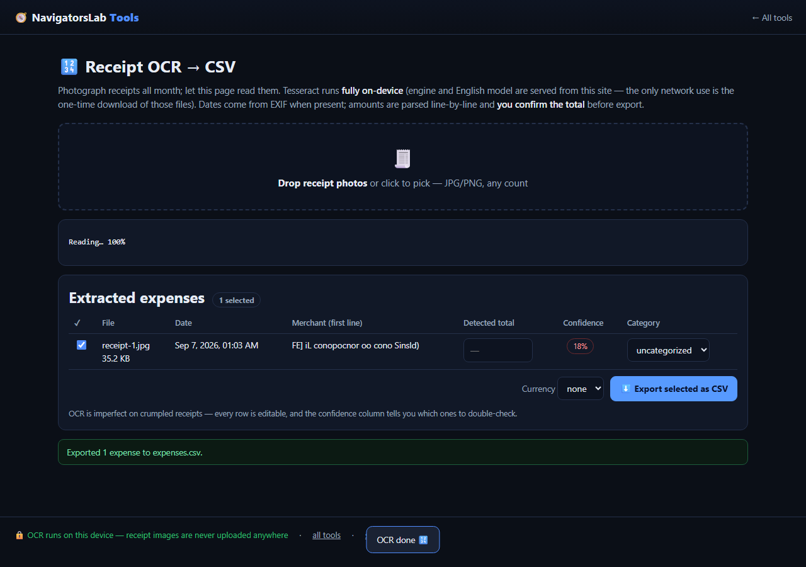
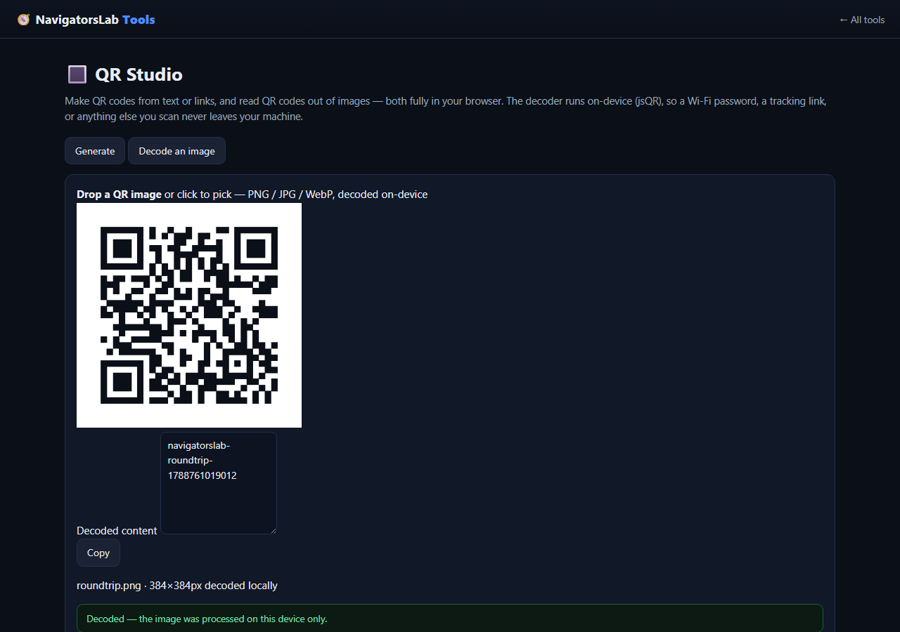
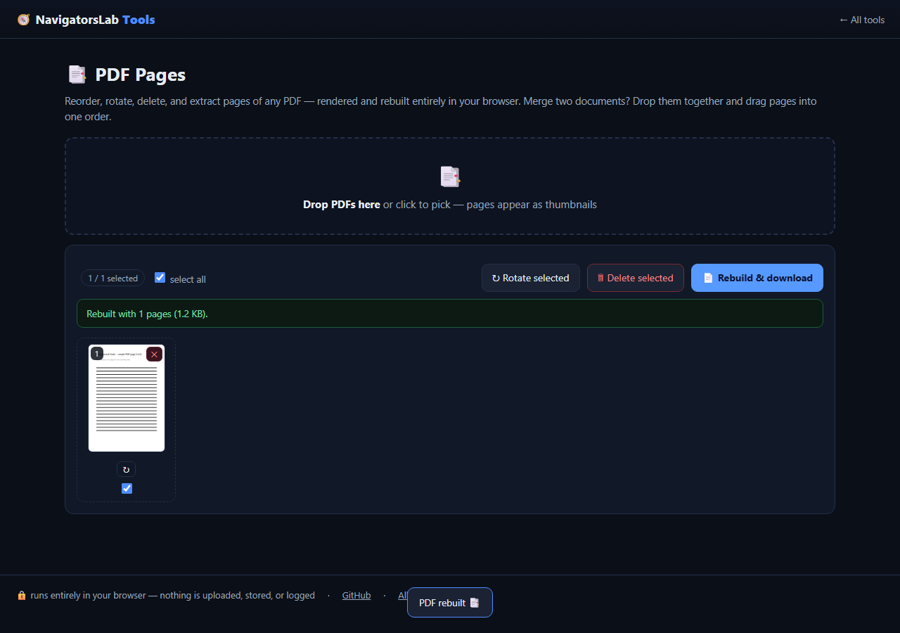
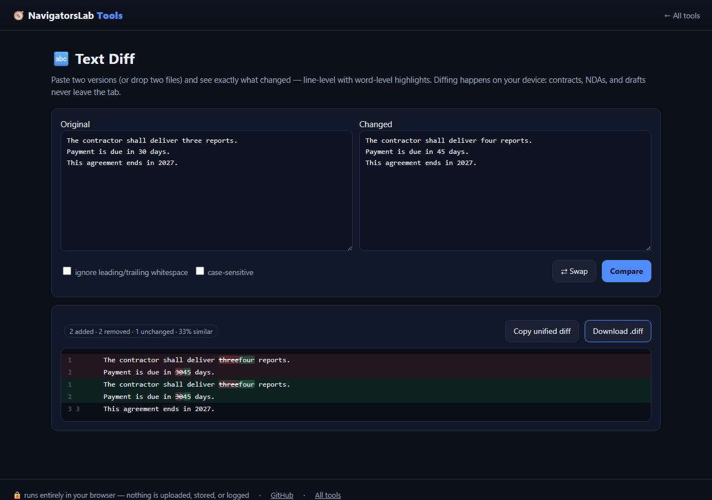
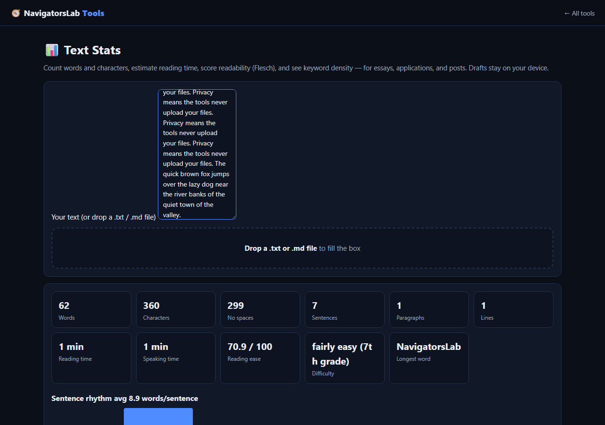

# 🧭 NavigatorsLab Tools

<div align="center">



**By NavigatorsLab** · free & open source · nothing you drop in ever leaves your device

[](https://github.com/Kayforkind/NavigatorsLab-Tools/actions/workflows/ci.yml)
[](LICENSE)
[](https://navigatorslab.com/tools/)


**Fifteen tools. Zero uploads. Zero accounts. Zero telemetry.**

</div>

---

## The toolbox

| | Tool | The problem it kills | Verified in CI |
|---|------|----------------------|----------------|
| 🛡️ | [**Photo Privacy Kit**](#️-photo-privacy-kit) | Vacation photos that leak your GPS location | APP1 segment absent in output JPEG |
| 🔍 | [**Metadata Checker**](#-metadata--hidden-data-checker) | Word/PDF files that remember every author | `docx` author shown, then stripped |
| 🗜️ | [**Image Shrinker**](#️-image-shrinker) | "This portal only accepts 2 MB" | 16 MB → 294 KB under a 300 KB target |
| 📄 | [**Scan & Screenshot Cleaner**](#-scan--screenshot-cleaner) | Crooked phone photos of documents | 2-page straight PDF out |
| ✍️ | [**Local E-Sign Pad**](#️-local-e-sign-pad) | "Just sign and send it back" at 11pm | Flattened (visual) signature inside the PDF |
| 🧾 | [**Receipts → One PDF**](#-receipts--one-pdf) | A shoebox of receipts at tax time | 3 pages, EXIF date order |
| 🔢 | [**Receipt OCR → CSV**](#-receipt-ocr--csv) | Expense-tracking data entry | Same-origin engine, CSV out |
| 🔳 | [**QR Studio**](#-qr-studio) | Sketchy generator sites and upload-to-decode scanners | Generate → decode round-trip matches |
| 📑 | [**PDF Pages**](#-pdf-pages) | "How do I even delete one page of a PDF?" | Rebuilt PDF has exactly the kept pages |
| 🔬 | [**Text Diff**](#-text-diff) | "What actually changed in this contract?" | 2 added · 2 removed with word highlights |
| 📊 | [**Text Stats**](#-text-stats) | Word limits and unreadable drafts | 62-word fixture counted exactly |
| 🎧 | [**Audio Trimmer**](#-audio-trimmer) | Cutting clips without uploading them | WAV data chunk = exact 1.000 s |
| 🧮 | [**Invoice Generator**](#-invoice--quote-generator) | Monthly fees for "text on a PDF" | $408.00 total in exported PDF |
| 🗂️ | [**Batch Rename & Sort**](#️-batch-rename--sort) | `IMG_5847.jpg` forever | `2026-09-05-home-depot.jpg` in ZIP |
| 🖨️ | [**Print-Shop Prep**](#️-print-shop-prep) | Bleed? DPI? What the shop actually needs | MediaBox = 306 pt (4.25 in) |

Every "Verified" cell is asserted by an automated browser test on every push — see [the security & verification gate](#-security--verification-gate).

Companion project: **[PDF Studio](https://github.com/Kayforkind/NavigatorsLab-PDF-Studio)** — the full in-browser PDF editor (edit PDF text in place, OCR, forms, redaction).

### One repo per tool

Prefer a standalone repo? Each tool has its own home — every one links straight back to the hub, where all 15 live together:

| | Tool | Standalone repo |
|---|------|-----------------|
| 🛡️ | Photo Privacy Kit | [NavigatorsLab-Photo-Privacy-Kit](https://github.com/Kayforkind/NavigatorsLab-Photo-Privacy-Kit) |
| 🔍 | Metadata & Hidden-Data Checker | [NavigatorsLab-Metadata-Checker](https://github.com/Kayforkind/NavigatorsLab-Metadata-Checker) |
| 🗜️ | Image Shrinker | [NavigatorsLab-Image-Shrinker](https://github.com/Kayforkind/NavigatorsLab-Image-Shrinker) |
| 📄 | Scan & Screenshot Cleaner | [NavigatorsLab-Scan-Cleaner](https://github.com/Kayforkind/NavigatorsLab-Scan-Cleaner) |
| ✍️ | Local E-Sign Pad | [NavigatorsLab-E-Sign-Pad](https://github.com/Kayforkind/NavigatorsLab-E-Sign-Pad) |
| 🧾 | Receipts → One PDF | [NavigatorsLab-Receipts-to-PDF](https://github.com/Kayforkind/NavigatorsLab-Receipts-to-PDF) |
| 🔢 | Receipt OCR → CSV | [NavigatorsLab-Receipt-OCR](https://github.com/Kayforkind/NavigatorsLab-Receipt-OCR) |
| 🔳 | QR Studio | [NavigatorsLab-QR-Studio](https://github.com/Kayforkind/NavigatorsLab-QR-Studio) |
| 🎧 | Audio Trimmer | [NavigatorsLab-Audio-Trimmer](https://github.com/Kayforkind/NavigatorsLab-Audio-Trimmer) |
| 🧮 | Invoice / Quote Generator | [NavigatorsLab-Invoice-Generator](https://github.com/Kayforkind/NavigatorsLab-Invoice-Generator) |
| 🗂️ | Batch Rename & Sort | [NavigatorsLab-Batch-Rename](https://github.com/Kayforkind/NavigatorsLab-Batch-Rename) |
| 🖨️ | Print-Shop Prep | [NavigatorsLab-Print-Shop-Prep](https://github.com/Kayforkind/NavigatorsLab-Print-Shop-Prep) |
| 📑 | PDF Pages | [NavigatorsLab-PDF-Pages](https://github.com/Kayforkind/NavigatorsLab-PDF-Pages) |
| 🔬 | Text Diff | [NavigatorsLab-Text-Diff](https://github.com/Kayforkind/NavigatorsLab-Text-Diff) |
| 📊 | Text Stats | [NavigatorsLab-Text-Stats](https://github.com/Kayforkind/NavigatorsLab-Text-Stats) |

---

## What the tools can do — v1.3 highlights

Every claim below is exercised by the automated gate (23 E2E checks, 59 unit tests). Not marketing — test results.

- **Everything accepts paste.** Ctrl/Cmd+V a screenshot or copied file on any tool page and it lands in the drop zone. Snip → paste → done.
- **Photo Privacy Kit** strips GPS/camera/timestamps and now shows **SHA-256 fingerprints** of original vs. cleaned files — cryptographic proof that "same picture, minus the metadata" (the E2E suite verifies pixel-identical output). Paste support means screenshots get scrubbed in two keystrokes.
- **Image Shrinker** targets an exact byte size via binary-searched quality in **JPG, WebP or AVIF**, streams per-file progress, survives unreadable images, and zips multi-file batches.
- **Scan & Screenshot Cleaner** gained **auto-levels** (content-aware black/white point stretch) and **threshold** (pure photocopy black-on-white), alongside auto-straighten, fit-to-view crop, and 300 DPI PDF export.
- **Local E-Sign Pad** can stamp **today's date under the signature** — the gate parses the signed PDF and asserts the year is embedded next to the flattened ink.
- **PDF Pages** now has **extract-selected** and **insert blank page** (sized to its neighbor) on top of reorder/rotate/delete/merge.
- **Receipt OCR → CSV** adds per-row **expense categories** and a **currency** for the CSV, on top of on-device totals and confidence flags.
- **QR Studio** speaks the **Wi-Fi payload format** (with spec-correct escaping of `;` , `:` `,` and `\` in SSIDs/passwords — round-tripped through the decoder in CI), plus URL/mail/phone/vCard presets and selectable error correction.
- **Audio Trimmer** can **peak-normalize** the selection (quiet voice memos → uniform loudness) before WAV/MP3 export.
- **Text Diff** shows a **similarity percentage** and has a swap button; **Text Stats** draws a live **sentence-rhythm histogram**.

## 🤖 Built for AI agents, too (MCP + deep links)

This suite is not just for humans. Every tool is scriptable, and an **MCP (Model Context Protocol) server** speaks directly to AI agents:

- **MCP endpoint** — `POST https://navigatorslab.com/tools/mcp` — JSON-RPC 2.0, Streamable-HTTP-style, stateless, no auth. Methods: `initialize`, `tools/list`, `tools/call`. Compute tools: `nl_catalog`, `qr_payload` (Wi-Fi/vCard/mailto/text with spec-correct escaping), `text_diff` (LCS), `text_stats`.
- **Deep links** — every page accepts a strict allow-list of URL parameters: `qr.html?text=<payload>&ec=M` renders a QR with zero clicks, `shrink.html?url=<image>&format=webp&targetKB=300` pre-loads a same-origin file and pre-sets the target, `textdiff.html?a=<u1>&b=<u2>` compares two texts. The `?url=` loader is **same-origin only, enforced in code** — a crafted link can never make a tool pull files from a third-party host.
- **Machine-readable docs** — [`llms.txt`](public/llms.txt) + [`llms-full.txt`](public/llms-full.txt) (served at both `/tools/` and the site root), [`tools.json`](public/tools.json), and the full reference at **[/tools/agents](https://navigatorslab.com/tools/agents.html)**.

Quick check from any terminal:

```bash
curl -s https://navigatorslab.com/tools/mcp   -H 'content-type: application/json'   -H 'accept: application/json'   -d '{"jsonrpc":"2.0","id":1,"method":"tools/list"}'
```

## Privacy is the architecture, not a promise

These are static pages. There is **no server that could receive your files** — no upload endpoint, no queue, no storage bucket, no analytics, no cookies, no accounts. We keep **no attachments and no user information**, ever. What you drop in is processed by your own device and forgotten when you close the tab.

- ❌ **No attachments kept** — files never leave your machine; nothing is transmitted, retained, or backed up
- ❌ **No user information kept** — no accounts, no emails, no tracking cookies, no analytics, no fingerprinting
- ✅ **Free to use, open source (MIT)** — no premium tier, no watermarks, no file-size limits
- ✅ **Works fully offline** — PWA precaches every page and engine (including the 11 MB compressed OCR model); verified by a test that disables the network and runs a tool

Open devtools → Network while using any tool and watch it stay silent after load. Or don't take our word for it — the test suite asserts it on every release.

---

## 🛡️ Photo Privacy Kit

**The problem:** your vacation photo contains the GPS coordinates of your hotel — or your home. Phones embed latitude/longitude, the exact camera model, and the precise timestamp into every JPEG.

**How it works:** drop one or a hundred photos. Each is scanned locally with a byte-level EXIF parser that reads the JPEG APP1 segment; GPS coordinates are decoded from degrees-minutes-seconds rationals, camera and dates from the IFD chains. Stripping rewrites the JPEG by removing every APP1 Exif segment while keeping the image data byte-identical — no re-encode, zero quality loss.

**Verified example (this exact run):** a fixture photo tagged at 41.0°N 29.0°E with camera "NavCam Pixel 99" was scanned → GPS leak flagged → stripped → the output JPEG contains no APP1 segment at all.


- Bulk: drop the whole camera folder, get one ZIP of clean copies
- GPS detected? The file is flagged red before you export anything
- Non-JPEG formats pass through untouched (no wasteful re-compression)
- Installed as an app? Right-click any photo on your desktop → *Open with → NavigatorsLab Tools* — it lands straight in the privacy kit

## 🔍 Metadata & Hidden-Data Checker

**The problem:** files carry more than you think — Word documents remember every author and revision, spreadsheets remember the company name and total editing time, photos remember where you stood.

**How it works:** three parsers run locally — the JPEG EXIF reader, pdf-lib's info dictionary (Title/Author/Subject/Keywords/Creator/Producer/dates), and an OOXML reader that unzips `.docx/.xlsx/.pptx` in memory and reads `docProps/core.xml` + `app.xml`. Stripping rewrites what's safe: PDF info fields are blanked via pdf-lib re-save; OOXML core/app properties are emptied and re-zipped, leaving document content byte-faithful.

**Verified example:** a fixture `.docx` authored by "J. Hidden", last modified by "Editor Person", at company "Stealth Co" with 240 editing minutes — all shown in the UI; the GPS fixture photo showed `GPS 41.000000, 29.000000`. Stripped downloads were produced for both.


## 🗜️ Image Shrinker

**The problem:** "This portal only accepts files up to 2 MB." Every online compressor wants your photo uploaded to their servers first.

**How it works:** the image is decoded in your browser to canvas pixels, optionally downscaled to your max width, then binary-searched across JPEG/WebP quality levels — 8 iterations of encode-and-measure — until the output lands **under your exact target size**. PNG (lossless, no quality knob) is handled by progressive downscaling until it fits.

**Verified example:** a ~16 MB 4000×3000 PNG was compressed to a **294 KB JPEG under a 300 KB target**, downloaded as `big-photo-shrunk.jpg`.


- Target-size mode: "make it ≤ 500 KB" — done
- Quality-slider mode when you just want "smaller, same format"
- Converts JPG ↔ PNG ↔ WebP; HEIC works wherever your browser decodes it

## 📄 Scan & Screenshot Cleaner

**The problem:** you photographed a 3-page contract with your phone. It's crooked, grayish, and 8 MB per page.

**How it works:** each photo becomes a canvas page. Auto-straighten estimates skew by correlating column darkness profiles across a ±4° search and rotates to cancel it. Grayscale uses proper luma weights (0.299/0.587/0.114); contrast uses the classic factor formula. Pages stack into a single PDF at ~150 DPI via pdf-lib — pages sized to the content.

**Verified example:** two receipt photos → grayscale + contrast 40 applied → exported as a **2-page 70 KB PDF**.


- Drag-rectangle crop with live dashed preview
- Per-page editing, thumbnail navigation, rotate ±90°
- Save any page as PNG instead of the whole PDF

## ✍️ Local E-Sign Pad

**The problem:** "just sign this and send it back" — at 11pm, with no printer and no DocuSign account.

**How it works:** draw on the pressure-friendly pointer-capture pad (or type your name in a handwriting font). The signature is trimmed to its ink bounding box, embedded as a transparent PNG, and you click exactly where it lands on any PDF page. pdf-lib burns it into the page content stream — flattened, so no editable signature field remains, it's just ink on the document - a **visual** signature, not a cryptographic/PKCS one.

**Verified example:** a drawn squiggle was placed mid-page on a fixture PDF and exported as `signed.pdf` — 6 KB, signature image confirmed inside the page resources.


- Ink color + thickness controls; typed-signature mode with two font styles
- Click again to reposition, size field in PDF points
- Multiple pages: pick the page from the dropdown, the preview follows

## 🧾 Receipts → One PDF

**The problem:** freelancers and landlords photograph receipts all month, then face a folder of `IMG_5847.jpg … IMG_6113.jpg` at tax time.

**How it works:** every dropped photo's capture date is read from EXIF `DateTimeOriginal` (the real date taken — not the copy date), falling back to the file modification date. Rows sort oldest→newest and can be nudged manually. Export builds one PDF with each receipt fitted to the page (A4/Letter), stamped with its date and original filename — auditable without opening the photos again.

**Verified example:** three receipts dropped in shuffled order (3, 1, 2) exported as a **3-page 108 KB PDF, correctly ordered**, each page stamped with its date and filename.


## 🔢 Receipt OCR → CSV

**The problem:** expense tracking dies at data entry. Twelve paper receipts, one spreadsheet, zero motivation.

**How it works:** the Tesseract OCR engine (WASM build) runs **inside your browser** — engine, WASM core and English model are served from this same site and precached by the service worker, so after the first visit it works fully offline. Each receipt photo is recognized on-device, and a domain parser picks the merchant (first meaningful line) and the most plausible total from candidates like `TOTAL $23.98` and `AMOUNT DUE`. EXIF `DateTimeOriginal` provides the expense date; every row shows its OCR confidence and stays editable before you export.

**Verified example:** a receipt fixture was recognized entirely locally → `expenses.csv` exported with the correct header (`date,merchant,amount,file,ocr_confidence`) and one editable row — no byte ever left the browser.



- Confidence badges (green ≥80%, amber ≥55%) show which rows deserve a human glance
- Amounts are editable in the table before export — OCR proposes, you decide
- CSV opens directly in Excel, Numbers, Google Sheets, or any accounting import

## 🔳 QR Studio

**The problem:** every "free QR generator" site logs what you encode (a Wi-Fi password is a secret), and every "scan this QR" web app wants camera or upload access to your images.

**How it works:** generation uses `qrcode-generator` locally — text or URLs in, auto-sized module grids out, rendered crisp at 256–1024 px with optional quiet zone, exported as PNG (nearest-neighbor, perfectly square modules) or infinite-resolution SVG. Decoding uses jsQR on canvas pixel data with both inversion attempts, so dark-on-light and light-on-dark codes both read. Nothing touches the network.

**Verified example:** a unique payload was encoded → a 29×29-module PNG exported (6 KB) → that exact PNG fed to the decoder → the decoded text **matched the original payload character-for-character**.



- Wi-Fi credentials, payment links, tickets — encoded and decoded on-device
- Custom foreground/background colors (contrast-safe defaults)
- SVG export stays vector-crisp at any print size

## 📑 PDF Pages

**The problem:** deleting, rotating, or reordering PDF pages usually means paid software or an upload-to-a-server service — with your documents as the price.

**How it works:** pages render to thumbnails locally with pdf.js, you drag to reorder, rotate/delete per page or in bulk, and the output PDF is rebuilt with pdf-lib by copying pages in visual order — rotations applied as real page attributes. Multiple dropped documents merge into one grid.

**Verified example:** a 2-page fixture → delete page 1 → rebuilt PDF contains exactly the remaining page.



## 🔬 Text Diff

**The problem:** comparing contract revisions means either squinting or pasting confidential text into a web service.

**How it works:** an LCS dynamic-programming engine (unit-tested, pure TypeScript) aligns lines; adjacent removed/added line pairs get **word-level inner highlights** so the actual change inside a line is visible. Whitespace and case options, unified-diff copy/download.

**Verified example:** "30 days → 45 days" style edits produce `2 added · 2 removed` with the changed words highlighted.



## 📊 Text Stats

**The problem:** word counters online are fine until you paste something private — or want more than a count.

**How it works:** a pure stats engine counts words/sentences/paragraphs (Unicode-aware), estimates reading (238 wpm) and speaking (140 wpm) time, computes the **Flesch Reading Ease** score with a grade interpretation, and extracts top keywords with stopwords removed. All live, all local.

**Verified example:** a 62-word fixture counted exactly, top keyword surfaced, reading ease bounded 0–100.



## 🎧 Audio Trimmer

**The problem:** you need the first 40 seconds of a voice note, and every online cutter wants the upload first.

**How it works:** the file is decoded with the Web Audio API to raw Float32 samples; the waveform is drawn min/max-per-pixel for honest peak display. Drag the region handles (or type exact seconds), optionally add fade-in/out shaped per-sample, then export — WAV as a hand-built canonical 44-byte-header PCM file, MP3 through lamejs encoding at 128–320 kbps.

**Verified example:** a 3 s 440 Hz tone loaded at 48 kHz; a 1.000 s selection (1.0 s→2.0 s) exported as a WAV whose data chunk is **exactly 96000 bytes = 1.0 s × 48000 Hz × 2 bytes**, sample-rate-checked from the output header itself.


## 🧮 Invoice / Quote Generator

**The problem:** invoicing sites charge monthly for what is ultimately "text on a PDF."

**How it works:** a live canvas preview mirrors the PDF renderer exactly — same layout, same right-aligned math. Subtotal → discount → tax → total is computed per keystroke. Export redraws the identical layout with real vector text via pdf-lib (StandardFonts, no font uploads), so the PDF is crisp at any zoom and searchable.

**Verified example:** "Deck repair, 4 × $85" with 20% tax → live preview showed **$408.00** and the exported PDF carried the same total; `INV-2026-001.pdf` produced.


- Invoice/Quote toggle, Clean & Classic templates, 5 currency symbols
- Multiple line items with add/remove, notes field for payment terms

## 🗂️ Batch Rename & Sort

**The problem:** every photographer and every Downloads folder: hundreds of files named by a camera that doesn't know your life.

**How it works:** names are built from a pattern (`{date}-{slug}`, `{date}-{n}`, `{n}-{slug}`…), where **date comes from EXIF `DateTimeOriginal`** — the moment you pressed the shutter, not when the file was copied. Slugs are slugified (lowercase, hyphenated, punctuation-stripped), collisions are auto-deduped (`-1`, `-2`), and the result ships as a ZIP built in-memory with renamed entries.

**Verified example:** two photos (one EXIF-dated 2026-09-05, one from file date) renamed with the fixed slug "home-depot" → `2026-09-05-home-depot.jpg`, `2026-09-06-home-depot.jpg`.


## 🖨️ Print-Shop Prep

**The problem:** the print shop asks for "4×6 with 0.125in bleed at 300 DPI" and suddenly you're reading a Wikipedia article.

**How it works:** choose an output size (4×6, 5×7, A4, Letter, 8×8 square), orientation, and bleed; the tool renders the print at **exactly 300 DPI** (4×6 + bleed = 1275×1875 px), center-cropping to fill or letterboxing with white bars. The DPI checker warns **before** you pay for a blurry print when the source doesn't have enough pixels. Export produces PNGs and a PDF whose MediaBox is the *exact physical size in points* (4.25 in → 306 pt) — print at "Actual size / 100%" and it comes out true.

**Verified example:** fixture photo → 4×6 in with 0.125 in bleed → **1275×1875 px** canvas at 300 DPI, exported PDF page measured at **306.0 pt wide**, DPI-per-source shown in the UI.


---

## Works on your phone

The suite is fully responsive — the redesigned hub and every tool verified at a 390×844 mobile viewport with **zero horizontal overflow**:


---

## 🔐 Security & verification gate

Every push runs a **44-check automated gate** in GitHub Actions before anything ships:

**Functional (20 checks)** — Playwright drives every tool with real files and validates the downloaded bytes: page counts via pdf-lib, WAV data-chunk math against the header's own sample rate, APP1 absence in stripped JPEGs, MediaBox points, invoice totals, CSV structure, ZIP entries, a full QR generate→export→decode round-trip, and a PDF delete→rebuild page-count check.

**Security (24 checks)** — `scripts/security.cjs`:

- **Network silence** — on every page, zero requests to any non-self origin, at load and idle
- **Exfil scan** — no non-GET request (fetch/POST/beacon) is even attempted
- **Storage hygiene** — no cookies ever; localStorage limited to recents, the invoice draft, and SW cache keys
- **Malicious inputs** — garbage "JPEG"s, corrupt ZIP/DOCX, malformed PDFs, and ``-payload filenames are dropped into the tools; nothing crashes, nothing executes
- **Parser fuzzing** — 14 property-based tests hammer the EXIF parser with random buffers and adversarial TIFF offsets (`0x7fffffff`, lying lengths, out-of-bounds IFD pointers); it never throws
- **Headers** — a strict CSP (`default-src 'none'`, no third-party origins, `frame-ancestors 'none'`) plus HSTS, nosniff, no-referrer, and a locked-down Permissions-Policy, delivered on every page
- **Secrets scan** — every shipped file checked against key/token patterns
- **Dependency audit** — `npm audit` on production dependencies (currently **0 vulnerabilities**)

```text
E2E:       20/20 ✅   (offline-PWA, exif, shrink, scan, esign, receipts, metadata,
                      audio, invoice, rename, printprep, ocr, qr, hub)
Security:  24/24 ✅   (headers, traversal, secrets, net×13, storage, fuzz×3, xss)
Units:     48/48 ✅   (EXIF parser + fuzzing, WAV math, receipt totals, diff engine, text stats)
Mobile:    0px  ✅    (horizontal overflow, 390×844, 5 pages)
Lighthouse: 98–100 ✅ (perf / a11y / best-practices / SEO, all 13 pages)
```

---

## Run it yourself

```bash
npm install
npm run dev          # http://localhost:5177 — the hub with all 15 tools
npm test             # unit tests incl. EXIF fuzzing
npm run typecheck    # strict TypeScript
npm run build        # static build in dist/ — deployable anywhere
npm run serve:dist   # serve dist/ with correct MIME types

# full gate (needs playwright + fixtures):
node scripts/make-fixtures.cjs
node scripts/serve.cjs &      # serves dist/ on :5178
node scripts/e2e.cjs          # 20 functional checks
node scripts/security.cjs     # 24 security checks (serves itself on :5199)
node scripts/mobile-shot.cjs  # mobile overflow check
```

Test fixtures are generated in-repo by `scripts/make-fixtures.cjs` — the GPS-tagged JPEG is spliced byte-by-byte and independently confirmed by an external EXIF parser; the sample PDF is built with pdf-lib. No Python, no network, no hand-placed files. Screenshots in `docs/shots/` are captured by the same scripts, so this documentation can be regenerated from the code at any time.

## Stack & structure

- Vite multi-page app — one `dist/` serves the site root, `/tools/`, and GitHub Pages subpaths (relative base)
- **PWA**: Workbox precache of every page, asset, and engine — all eleven tools work offline after first load; images can be opened straight from the OS via `file_handlers`
- Hub rendered from a single `public/tools.json` (one source of truth for names, taglines, categories)
- Social-ready: per-page Open Graph/Twitter cards, `sitemap.xml`, `robots.txt`
- Hub chrome speaks **English, Türkçe, and Deutsch** (EN/TR/DE switcher, persisted locally)
- Zero UI frameworks; shared CSS design system in `src/styles.css`
- `src/lib/exif.ts` — byte-level JPEG/TIFF EXIF parser + APP1 stripper (fuzz-tested)
- pdf-lib for every PDF operation · Web Audio API + lamejs for audio · JSZip for archives · self-hosted Tesseract WASM for OCR · qrcode-generator + jsQR for QR · pdf.js for local page rendering
- Each tool ships its own Open Graph preview image (`og-<tool>.png`) — every page looks right when shared
- **Lighthouse 98–100** on all 13 pages (performance, accessibility, best-practices, SEO)
- Strict CSP on every response — `public/_headers` in production, the same policy asserted by the security suite

## License

MIT. Use it, fork it, self-host it. If it saves you a subscription, tell someone where you got it.

**NavigatorsLab** — local-first, private-by-default software. [PDF Studio](https://github.com/Kayforkind/NavigatorsLab-PDF-Studio) · [navigatorslab.com](https://navigatorslab.com/)

<div align="center">
<sub>No accounts. No uploads. No telemetry. Just tools that respect you.</sub>
</div>
